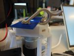
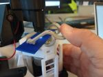
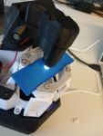
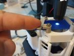
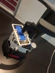
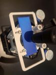
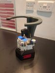
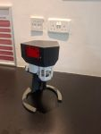
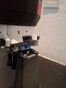

# Custom 3D printed files for OpenFlexure Microscope

## [Status: In progres, ideas, development]

## Adjusted slide holding clips
- Need to be installed in reverse position, due to the levers
- Widen grip for holding edge of the slide

## Front clamps for holding slide
- Slide can easily click in the clamp
- Slide can still manually move along its length

## Side clamps for holding slide
- Holds very firmly

## Frame clamps for holding slide
- For moving in X and Y directions if the slide is not well centered.
- Allows limited movement front and back, and wider movement left and right

## Electronics cover to protect from spillage 
- Need adjustments for cable management
- Design with no changes to original drawer

## Upside down stand for the microscope
- Uses the condenser attachment
- Bottom part could be replaced by metal to provide better stability or attached to the table
- Attach the frame to the front side using 2x M3x10 DIN 912 bolts and washers.
- Secure the back side by inserting 2x hex head M3x25 bolts through the OpenFlexure illumination adjustment knobs. First, position the top holder over the frame before inserting the bolts.

