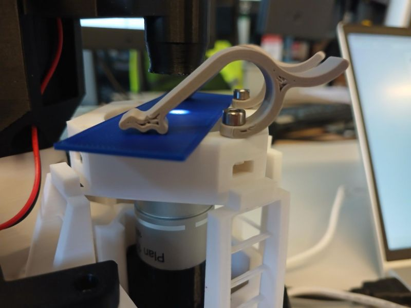
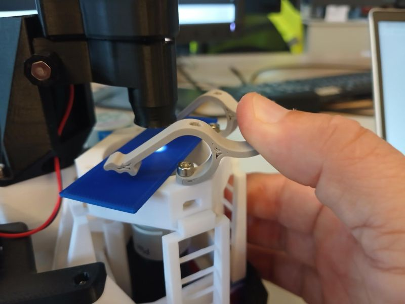
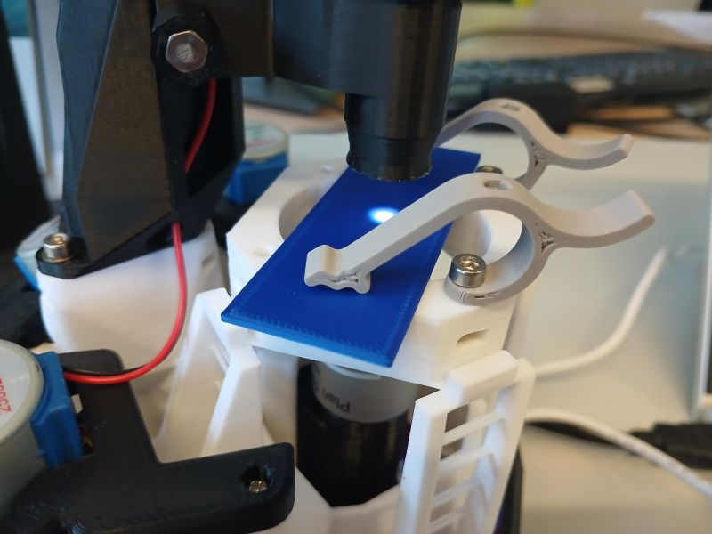
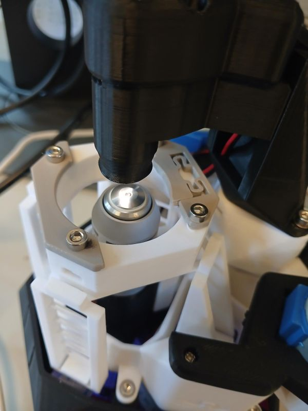
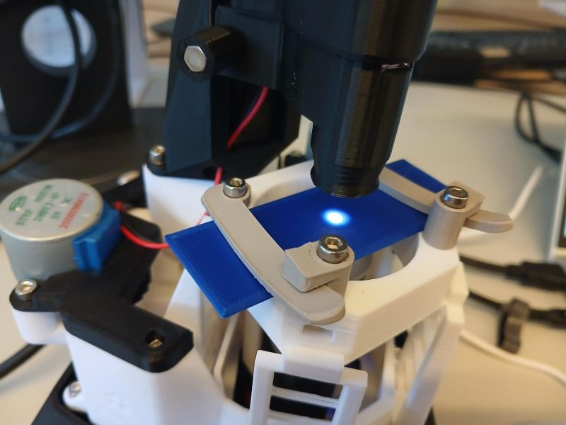
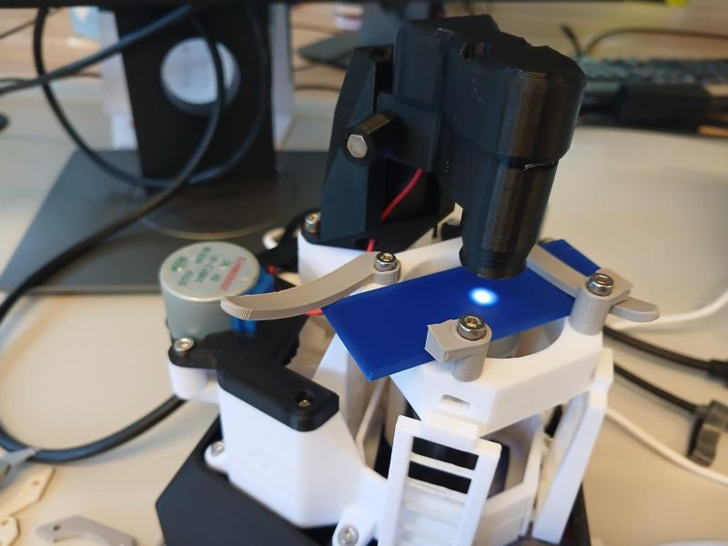
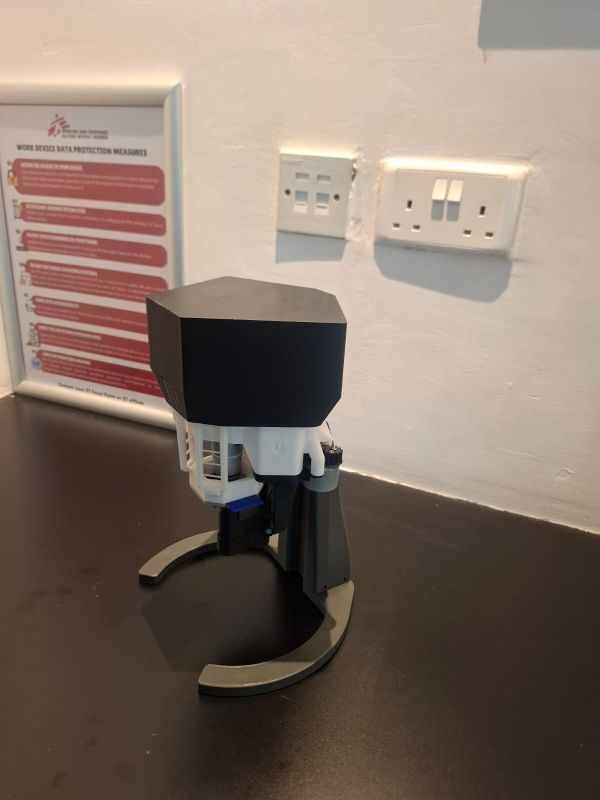
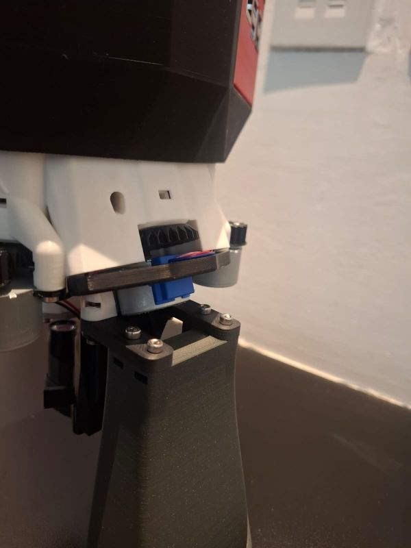

# Custom 3D printed files for OpenFlexure Microscope

## [Status: In progres, ideas, development]

## Adjusted slide holding clips

## Front clamps for holding slide

## Side clamps for holding slide

## Electronics cover to protect from spillage 

## Upside down stand for the microscope

